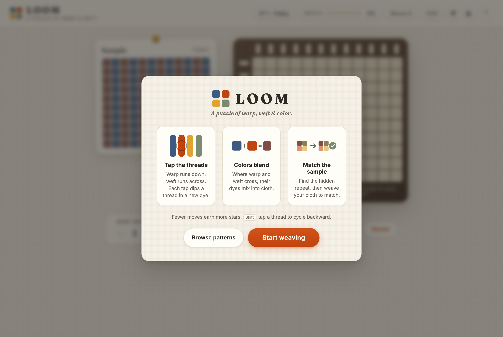
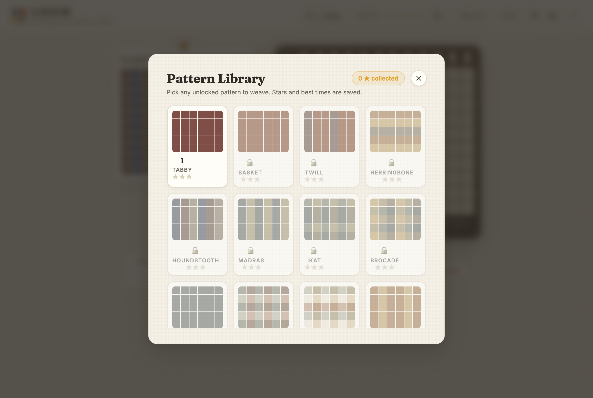
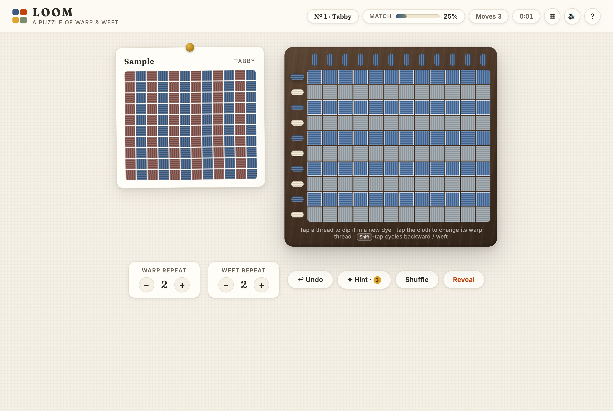
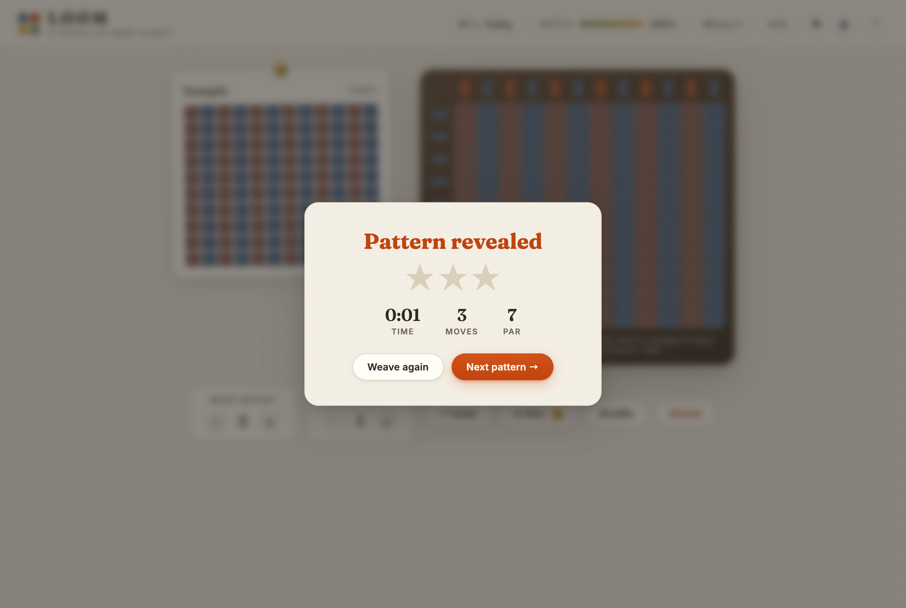

# LOOM

A meditative puzzle of warp, weft and color. Find the hidden repeat and weave the cloth to match the sample.

## Screenshots


*The welcome screen: tap threads, colors blend, match the sample.*


*The Pattern Library: browse every level, see previews, stars and best stats.*


*The loom: dye the warp and weft threads, tune the repeat, and watch the cloth change.*


*A finished weave — stars, time and move count on the win card.*

## The Idea

People rarely notice how small, intentional choices create ordered beauty — in textiles, music, or systems. LOOM makes that instinct playable.

Every vertical **warp** thread and horizontal **weft** thread carries a dye. Where they cross, the two dyes **blend** into a square of cloth. A short warp sequence repeats across the loom; a short weft sequence repeats down it. Your job: reproduce the sample cloth by discovering the small repeat hidden inside the surface.

It's a genuine 2D constraint puzzle that quietly teaches the "see the repeat" instinct behind weaving, design, and modular arithmetic.

## How to Play

- **Dye a thread** — click a warp or weft thread to cycle it through the dyes (Indigo → Madder → Ochre → Sage → Cream). <kbd>Shift</kbd>-click cycles backward.
- **Tap the cloth** — clicking a cloth cell changes the warp thread running through it (<kbd>Shift</kbd>-click changes the weft).
- **Set the repeat** — use the warp/weft repeat steppers to change how many distinct threads run through the loom.
- **Hover a thread** to see exactly which cloth cells it passes through.
- **Browse patterns** — open the Pattern Library (▦ in the header, or "Browse patterns" on the start screen) to see previews, your stars and best stats, and jump to any unlocked level.
- **Match 100%** of the sample to win.

## Features

- **Hand-tuned difficulty curve** — 10 named patterns (Tabby → Jacquard) with growing repeats and dye counts, then endless mode.
- **Pattern Library** — browse all levels from the intro or the ▦ button: live cloth previews, lock/unlock progression, earned stars, and best time/moves per level. Jump straight to any unlocked pattern.
- **Star scoring** — finish under par moves for ★★★; best stars, times and move counts are saved per level.
- **Hints** — 3 per level; a hint names the exact thread and dye to try, and lights the crossing.
- **Undo** — full history, including repeat changes (<kbd>Z</kbd>).
- **Timer & move counter** in the HUD.
- **Progress saving** — level, sound preference and best stats persist in `localStorage`.
- **Polish** — woven cloth texture, wooden loom frame, thread-scrap confetti, gentle WebAudio chimes, keyboard shortcuts, reduced-motion support.

## Controls

| Action | Input |
| --- | --- |
| Cycle dye forward | Click thread / cloth cell |
| Cycle dye backward | <kbd>Shift</kbd> + click |
| Undo | <kbd>Z</kbd> or Undo button |
| Hint | <kbd>H</kbd> or Hint button |
| Pattern Library | ▦ button (header) or "Browse patterns" |
| Sound on/off | 🔊 button |

## Run It

No build step — it's plain HTML/CSS/JS.

```bash
# serve the folder (any static server works), e.g.:
python3 -m http.server 8000
# then open http://localhost:8000
```

To regenerate the README screenshots (uses a workspace-local Playwright + Chromium):

```bash
node capture.js
```

## Future Roadmap

- Premium packs: historical textiles (Kente, Kasuri, Tartan…)
- A free-weave mode for designing your own cloth
- Daily weave challenges with shareable patterns
